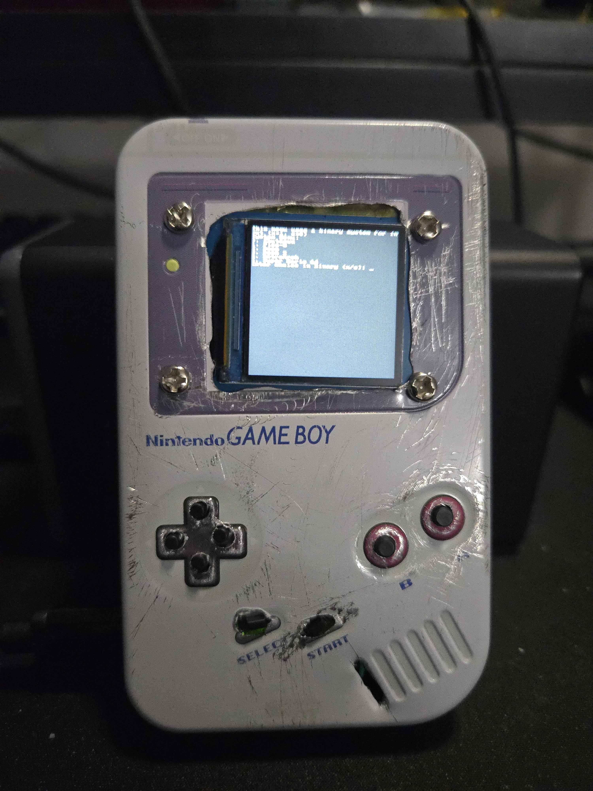

# Pico-8 Tin Project
This projects goal was to build a portable pico-8 device in a Nintendo Gameboy candy tin. After building it I expanded it with other games, like doom lol, but those can be removed pretty easily. This was a home project made for fun by a complete novice, so the work is scuff but working. I'm sure many can do it much better, but it was fun to build. This Readme is a work in progress btw

## Hardware used
Raspberry Pi Zero W 2
PiSugar S
Waveshare 1.3inch LCD
micro-sd card
Some wires and buttons

## Main Software Used
2023-05-03-raspios-bullseye-armhf-lite
  - https://downloads.raspberrypi.org/raspios_lite_armhf/images/raspios_lite_armhf-2023-05-03/2023-05-03-raspios-bullseye-armhf-lite.img.xz

Screen Driver
  - https://files.waveshare.com/upload/f/f9/Waveshare_fbcp.7z

xorg

## Main Game Software Used
pico-8

chocolate-doom

retroarch

## Games Preconfigured
Pico-8

Doom 1 & 2

RetroArch

SM64

## Scripts
installScreen1.sh & installScreen2.sh
  - Guided install scripts to setting up the screen to work with the pi.
  - Device will need to reboot twice during setup
  - Only need to run installScreen1.sh as it will run the second one when needed

bootMenu.sh
  - Custom Terminal Menu for launching games
  - Setup to run on boot if gamesInstall.sh was used

gamesInstall.sh
  - Games and Menu Setup

doom1.sh
  - Scripted used to boot doom 1 instead of 2

sm64.sh
  - Scripted used to boot sm64

## Files Needed Outside of this Repo
If you run the install scripts they get all the fills from a python server with the needed files in home directory. No copyrighted or paid content is included here, so go get it yourself.
Pico-8
  - https://www.lexaloffle.com/pico-8.php
  - Download the Raspberry Pi version and rename to pico.zip

Doom 1 & 2
  - DOOM.WAD and DOOM2.WAD

RetroArch
  - No roms are auto added, but a file structure is made for gb, gbc, and nes
  - roms/gb roms/gbc roms/nes

SM64
  - This scripted builds the decomp of sm64 to run directly on the pi instead of an emulator. This means you need to provide your sm64 dump named sm64.z64
  - The configs at of writing are not 100% complete, so you will need to shutdown your pi to exit.

## Screen Setup
NOTE: 
This will guide how I setup the device, but there is lots of room to do it other ways. Also the Waveshare 1.3inch LCD Hat works with the screen setup, so you can use that before committing to soldering the regular screen. There is a seperate installScreen2HAT.sh that can be used instead for better button support.
1. Flash 2023-05-03-raspios-bullseye-armhf-lite onto a micro-sd card with Raspberry Pi Imager and customize user settings for connecting to wifi
2. Connect either the HAT or solder the screen according to their image [here](https://www.waveshare.com/w/upload/thumb/c/cb/1.3-rpi.jpg/800px-1.3-rpi.jpg)
3. Copy installScreen1.sh & installScreen2.sh to the device *I like doing this with wget and python server who could've guessed*.
4. Run the installScreen1.sh script and follow the instructions when told.
5. Profit aka the screen should work now and buttons if you soldered some or are using the HAT
  - We will get to soldering buttons in the button setup section

## Button Setup
NOTE: 
This will guide how I setup the device, but there is lots of room to do it other ways. Also the Waveshare 1.3inch LCD Hat works with buttons, so you can use that before committing to soldering seperate buttons. Software side there is a seperate installScreen2HAT.sh that can be used instead for better button support.
1. There is many free GPIO pins, so you don't need to use what I used. Regardless, we need a total of 8 inputs (4 for dpad, select, start, B, and A). 
2. The installScreen2.sh we used earlier setup for buttons in the /boot/config.txt file. Edit this file if you want to edit the gpio used or what keys they are programmed to. Default is arrow keys for the dpad, space for select, enter for start, x for the B button, and c for the A button.
3. I have provided a diagram of how I wired my buttons, but if you edited the used gpio make changes accordingly. I also used buttons from [this](https://a.co/d/0dWGZrfz) button kit, but use whatever you want. Make sure your wires are long enough to reach where you drill into the case

## Case Setup
This is pretty straight forward as you just need to cut and drill holes were you want/need them for the case. Heres a picture of my case with the buttons and screen installed.
Notes when installing to the case
1. Insulate the inside of the case to avoid power flowing into it, since the case is tin
2. I drilled in holes to use the screws for the screen
3. For buttons I just hot glued them into place after drilling holes.

